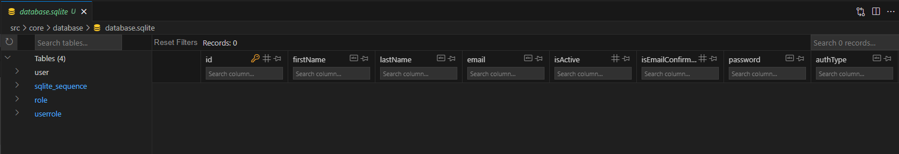
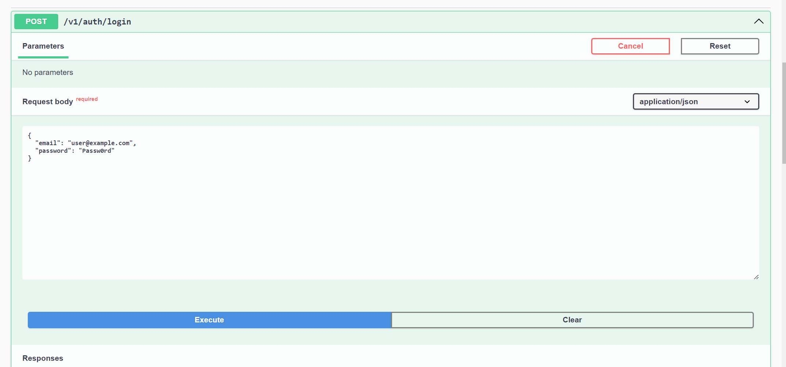
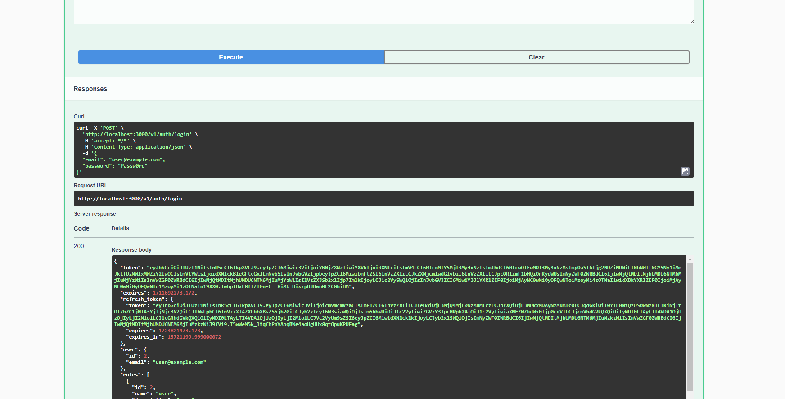
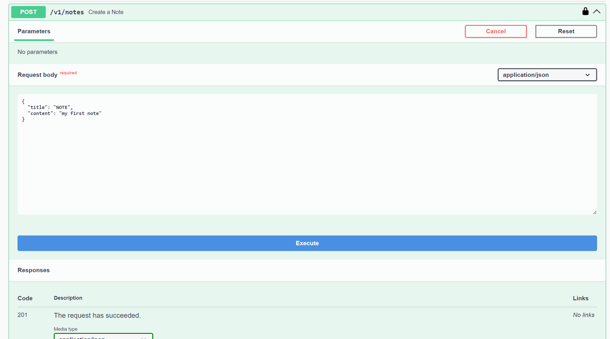

# Let's create a note api

Clone the Github repository.

```sh
git clone url
```

Go to your project folder.

```sh
cd ./flug-nest
```

## Installation

Install node dependencies:

```bash
npm i
```

Run inside your project folder to install the cli tool:

```bash
npm i -g
```

Thought this tutorial we will create the note module, so please before to start remove the [note](../modules/note/) directory.

Run the app for first time.

```bash
npm start
```

Press ctrl+c to stop the app.

## Database setup

Flug-Nest it's configured to work with sqlLite by default, so to continue install SQLite Viewer.


Go to the [database](../core/database/) directory and open the database.sqlite file.

If you installed the SQLite Viewer, you should see something like this:



let's Seed the database, the following command will create two users and two roles in your database.

```bash
npm run seed
```

## First Login

Start the app:

```bash
npm start
```

let's login to our app, go to
[http://localhost:3000/swagger#/auth/AuthController_signIn](http://localhost:3000/swagger#/auth/AuthController_signIn).


Click in Try it out Button and in the Request body paste:

```json
{
  "email": "user@example.com",
  "password": "Passw0rd"
}
```

Click Execute



Feel free to use the token to explore the other endpoints.

Press ctrl+c to stop the app.

## Note Module

Use the cli tool to create the note module.

```bash
flug-nest g api note -bU
```

Go to the [module](../modules/) directory and you will find the note module.

let's add a title and content to our note, go to the [create-note.dto](../modules/note/dto/create-note.dto.ts) file, remove name and add title and content properties.

```ts
import { ApiHideProperty } from '@nestjs/swagger';
import {
  IsNotEmpty,
  IsString,
  MaxLength,
  IsOptional,
  IsNumber,
} from 'class-validator';
export class CreateNoteDto {
  @IsNotEmpty()
  @MaxLength(255)
  @IsString()
  title: string;

  @IsNotEmpty()
  @MaxLength(255)
  @IsString()
  content: string;

  @ApiHideProperty()
  @IsOptional()
  @IsNumber()
  userId?: number;
}
```

We have to update the [update-note.dto](../modules/note/dto/update-note.dto.ts) file too.

```ts
import { IsNotEmpty, IsString, MaxLength, IsOptional } from 'class-validator';
export class UpdateNoteDto {
  @IsNotEmpty()
  @MaxLength(255)
  @IsOptional()
  @IsString()
  title?: string;

  @IsNotEmpty()
  @MaxLength(255)
  @IsOptional()
  @IsString()
  content?: string;
}
```

Now go to [note.entity.dto](../modules/note/entities/note.entity.ts) and remove name and add title and content columns.

```ts
import {
  BelongsTo,
  Column,
  DataType,
  ForeignKey,
  Table,
} from 'sequelize-typescript';
import { BaseModel } from '@libraries/BaseModel';
import { ApiHideProperty } from '@nestjs/swagger';
import { User } from 'src/modules/user/entities/user.entity';

@Table({
  tableName: 'note',
})
export class Note extends BaseModel<Note> {
  @Column({
    type: DataType.STRING,
    allowNull: true,
  })
  title: string;

  @Column({
    type: DataType.STRING,
    allowNull: true,
  })
  content: string;

  @ForeignKey(() => User)
  @Column({
    type: DataType.INTEGER,
    allowNull: false,
  })
  userId: number;

  @ApiHideProperty()
  @BelongsTo(() => User)
  user: User;
}
```

It's time to register you module into the [app.module.ts](../app.module.ts) file.

```ts
import { Module } from '@nestjs/common';
import { AppController } from './app.controller';
import { AppService } from './app.service';
import { UserModule } from './modules/user/user.module';
import { AuthModule } from './modules/auth/auth.module';
import { databaseModule } from './core/database/database';
import { NoteModule } from '@modules/note/note.module';

@Module({
  imports: [databaseModule, UserModule, AuthModule, NoteModule],
  controllers: [AppController],
  providers: [AppService],
})
export class AppModule {}
```

Start the app:

```bash
npm start
```

Go to[http://localhost:3000/swagger#/notes](http://localhost:3000/swagger#/notes).

If you are wondering, yes, swagger documentation is autogenerated 😄.

To use the note api the token is required if you lost it, got to login endpoint to get a new one.

Let's create a note:


Feel free to explore the other note endpoints 😄.
